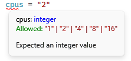
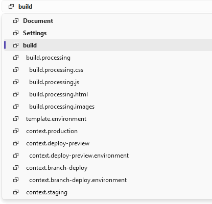
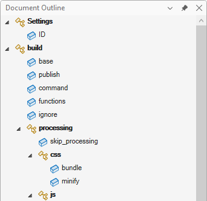
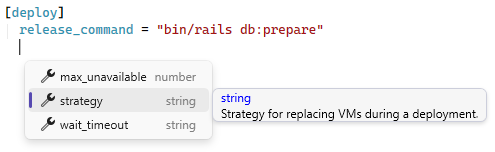
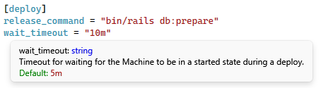

[marketplace]: <https://marketplace.visualstudio.com/items?itemName=MadsKristensen.TomlEditor>
[vsixgallery]: <http://vsixgallery.com/extension/TomlEditor.4e804652-a783-473b-827f-6e41f5a48b9b/>
[repo]:<https://github.com/madskristensen/TomlEditor>

# TOML Editor for Visual Studio

[](https://github.com/madskristensen/TomlEditor/actions/workflows/build.yaml)


**First-class TOML support in Visual Studio** — edit your configuration files with confidence.

[**Install from Visual Studio Marketplace**][marketplace] | [CI build][vsixgallery]


## Features

✅ **Syntax Highlighting** — Beautiful colorization for keys, values, tables, and comments  
✅ **Real-time Validation** — Catch errors as you type with instant feedback  
✅ **Navigation Bar** — Jump to tables and sections using the editor dropdowns  
✅ **Document Outline** — View and navigate your document structure in the Document Outline window  
✅ **Code Outlining** — Collapse and expand sections for easier navigation
✅ **Commenting** — Toggle comments with `Ctrl+/` or `Ctrl+K, Ctrl+C`  
✅ **Formatting** — Format Document (`Ctrl+K, Ctrl+D`) and Format Selection  
✅ **Smart Indentation** — Automatic indentation when pressing Enter  
✅ **Brace Matching** — Highlights matching brackets and quotes  
✅ **JSON Schema Support** — Validation and IntelliSense powered by JSON Schema  
✅ **Go to Definition** — Navigate to schema definitions with `F12`  
✅ **Find All References** — Find all occurrences of a key with `Shift+F12`  
✅ **Lightweight & Fast** — Designed for performance with zero impact on your workflow

Whether you're working with Cargo.toml, pyproject.toml, or any other TOML configuration, this extension makes editing a breeze.

---

### Syntax Highlighting

Full colorization support for all TOML elements including keys, strings, numbers, booleans, dates, tables, array of tables, and comments. The highlighting adapts to your Visual Studio color theme.

<!--  -->

### Real-time Validation

Errors are detected and underlined as you type. Hover over any error to see a detailed message explaining the issue. Errors also appear in the Error List window for easy navigation.



### Navigation Bar

Use the dropdown menus at the top of the editor to quickly jump between tables and sections in your document. The left dropdown shows the document structure, and the right dropdown shows the current section's contents.



### Document Outline

Open the Document Outline window (**View > Other Windows > Document Outline**) to see a hierarchical tree view of your TOML document. The outline displays:

- **Tables** — shown in bold with nested table hierarchy preserved
- **Array of Tables** — clearly distinguished from regular tables
- **Key-Value Pairs** — shown under their parent tables

Double-click any item to navigate directly to it in the editor. The outline automatically updates as you edit and syncs with your cursor position.



### Code Outlining

Collapse and expand table sections to focus on what matters. Click the minus icon in the margin or use `Ctrl+M, Ctrl+M` to toggle outlining.

### Commenting

Toggle line comments with `Ctrl+K, Ctrl+C` (comment) and `Ctrl+K, Ctrl+U` (uncomment), or use `Ctrl+/` to toggle. Works with single lines and selections.

### Formatting

Format your entire document with `Ctrl+K, Ctrl+D` or format a selection with `Ctrl+K, Ctrl+F`. The formatter normalizes whitespace and alignment for consistent, readable TOML.

### Smart Indentation

When you press Enter after a table header like `[section]`, the cursor automatically indents on the next line. Pressing Enter on an empty line removes unnecessary whitespace.

### Brace Matching

Matching brackets `[]`, `[[]]`, and quotes are highlighted when your cursor is adjacent to them, making it easy to see matching pairs.

### Find All References

Place your cursor on any TOML key and press `Shift+F12` (or right-click and select "Find All References") to see all occurrences of that key in the document. Results appear in the Output window with line numbers for easy navigation. This works for both root-level keys and keys within tables.

---

## JSON Schema Support

The extension provides schema-based validation and IntelliSense for TOML files.

### Automatic Schema Detection

Schemas are **automatically detected** for well-known TOML files using the [SchemaStore.org](https://www.schemastore.org/json/) catalog. Just open a file and it works!

Supported files include:

- `pyproject.toml` — Python project configuration
- `Cargo.toml` — Rust package manifest
- `.rustfmt.toml` / `rustfmt.toml` — Rust formatter configuration
- `netlify.toml` — Netlify deployment configuration
- `fly.toml` — Fly.io application configuration
- `samconfig.toml` — AWS SAM configuration
- And many more from [SchemaStore.org](https://www.schemastore.org/json/)...

### Manual Schema Directive

For files not in the catalog, or to override the automatic detection, add a `#:schema` directive at the top of your file:

```toml
#:schema https://dystroy.org/bacon/.bacon.schema.json

[jobs.check]
command = ["cargo", "check"]
```

You can use:

- **HTTPS URLs** — `<https://json.schemastore.org/pyproject.json`>
- **Local files** — `file:///C:/schemas/my-schema.json`

### IntelliSense

Press `Ctrl+Space` to see available keys, tables, and values at the current position. The completion list shows:

- **Keys** with their types (string, number, boolean, etc.)
- **Tables** with `[brackets]` indicating they are sections
- **Array of tables** with `[[double brackets]]`
- **Enum values** when a property has a fixed set of allowed values



### QuickInfo

Hover over any key to see its description, type, and whether it's required. For enum properties, you'll also see the list of allowed values.



### Schema Validation

When a schema is available, the extension validates your TOML in real-time:

- **Missing required properties** — warns when required keys are not present
- **Unknown properties** — flags keys that aren't defined in the schema
- **Type mismatches** — errors when values don't match expected types
- **Invalid enum values** — errors when a value isn't in the allowed list

<!--  -->

### Go to Definition

Press `F12` on any key to open the JSON schema file and jump directly to that property's definition. This is useful for understanding the full schema specification or contributing improvements.

---

## Getting Started

1. Install the extension from the [Visual Studio Marketplace][marketplace]
2. Open any `.toml` file
3. Start editing with full language support!

## How can I help?

If you enjoy using this extension, please give it a ⭐⭐⭐⭐⭐ rating on the [Visual Studio Marketplace][marketplace] — it really helps others discover it!

Found a bug or have a feature request? Head over to the [GitHub repo][repo] to open an issue.

Pull requests are welcome! This is a personal passion project, so contributions are greatly appreciated.

You can also [sponsor me on GitHub](https://github.com/sponsors/madskristensen) to support continued development.
