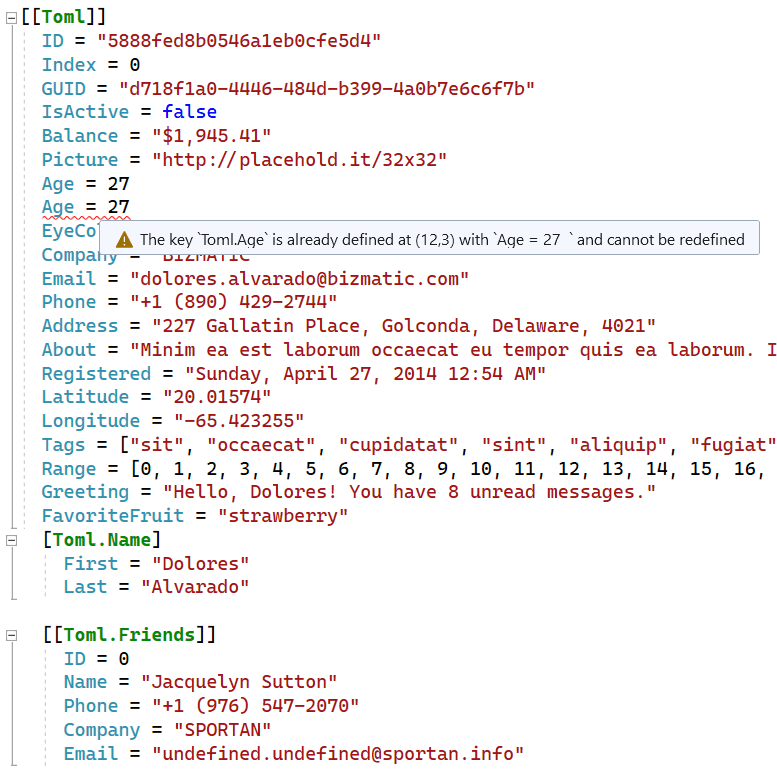

[marketplace]: https://marketplace.visualstudio.com/items?itemName=MadsKristensen.TomlEditor
[vsixgallery]: http://vsixgallery.com/extension/TomlEditor.4e804652-a783-473b-827f-6e41f5a48b9b/
[repo]:https://github.com/madskristensen/TomlEditor

# TOML Editor for Visual Studio

[](https://github.com/madskristensen/TomlEditor/actions/workflows/build.yaml)

**First-class TOML support in Visual Studio** — edit your configuration files with confidence.

[**Install from Visual Studio Marketplace**][marketplace] | [CI build][vsixgallery]



## Features

✅ **Syntax Highlighting** — Beautiful colorization for keys, values, tables, and comments  
✅ **Real-time Validation** — Catch errors as you type with instant feedback  
✅ **Code Outlining** — Collapse and expand sections for easier navigation  
✅ **Commenting** — Toggle comments with `Ctrl+/` or `Ctrl+K, Ctrl+C`  
✅ **Formatting** — Format Document (`Ctrl+K, Ctrl+D`) and Format Selection  
✅ **Smart Indentation** — Automatic indentation when pressing Enter  
✅ **Brace Matching** — Highlights matching brackets and quotes  
✅ **JSON Schema Support** — Validation and IntelliSense powered by JSON Schema  
✅ **Go to Definition** — Navigate to schema definitions with `F12`  
✅ **Lightweight & Fast** — Designed for performance with zero impact on your workflow

Whether you're working with Cargo.toml, pyproject.toml, or any other TOML configuration, this extension makes editing a breeze.

## JSON Schema Support

The extension provides schema-based validation and IntelliSense for TOML files.

### Automatic Schema Detection

Schemas are **automatically detected** for well-known TOML files using the [SchemaStore.org](https://www.schemastore.org/json/) catalog. Just open a file and it works!

Supported files include:
- `pyproject.toml` — Python project configuration
- `Cargo.toml` — Rust package manifest
- `.rustfmt.toml` / `rustfmt.toml` — Rust formatter configuration
- `netlify.toml` — Netlify deployment configuration
- `samconfig.toml` — AWS SAM configuration
- And many more...

### Manual Schema Directive

For files not in the catalog, or to override the automatic detection, add a `#:schema` directive at the top of your file:

```toml
#:schema https://dystroy.org/bacon/.bacon.schema.json

[jobs.check]
command = ["cargo", "check"]
```

You can use:
- **HTTPS URLs** — `https://json.schemastore.org/pyproject.json`
- **Local files** — `file:///C:/schemas/my-schema.json`

### What You Get

- **Validation** — Errors and warnings when your TOML doesn't match the schema
- **IntelliSense** — Autocomplete for keys and enum values (`Ctrl+Space`)
- **QuickInfo** — Hover over keys to see descriptions, types, and allowed values
- **Go to Definition** — Press `F12` on any key to open the schema and navigate to its definition

## Getting Started

1. Install the extension from the [Visual Studio Marketplace][marketplace]
2. Open any `.toml` file
3. Start editing with full language support!

## How can I help?

If you enjoy using this extension, please give it a ⭐⭐⭐⭐⭐ rating on the [Visual Studio Marketplace][marketplace] — it really helps others discover it!

Found a bug or have a feature request? Head over to the [GitHub repo][repo] to open an issue.

Pull requests are welcome! This is a personal passion project, so contributions are greatly appreciated.

You can also [sponsor me on GitHub](https://github.com/sponsors/madskristensen) to support continued development.